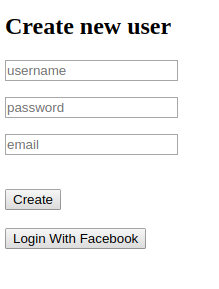
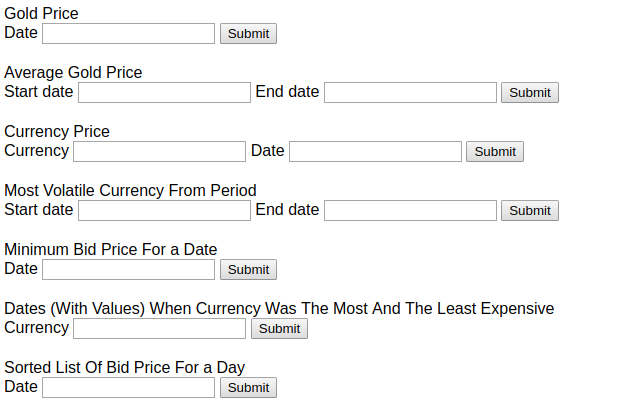
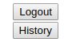

# nbp-app

Spring-boot application for http://api.nbp.pl
## Run 

Run with _docker-compose up_

Go to _localhost/register_ to create user account:

Go to _localhost/login_ to login:

Then you may use an 'interface'

See your requests history with History

